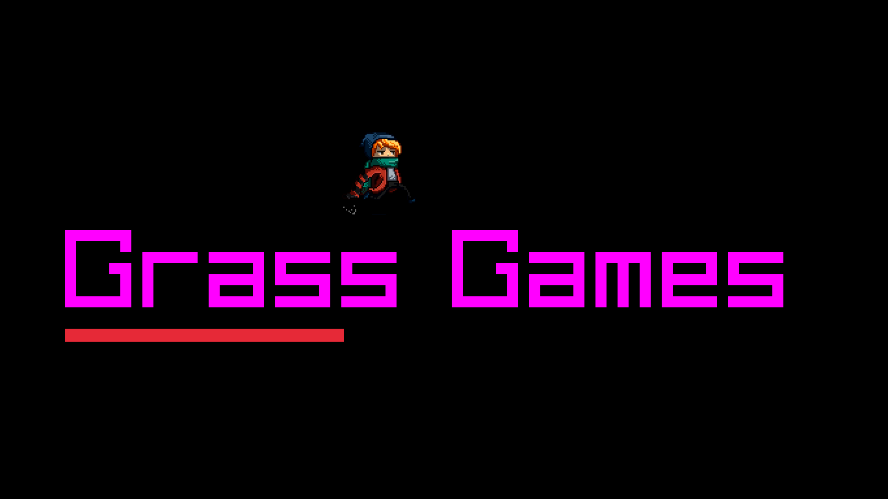

# Splashlib - "Grass Games" Welcome Screen

_(You'll want to replace this with your actual logo, if you have one\!)_

A simple, easy-to-integrate C++ library for creating a customizable welcome/splash screen for your games. Designed with Raylib in mind, Splashlib aims to give your games a polished entry point, while subtly promoting a healthy message: "Get outside, touch grass\!"

## Why Splashlib?

Every great game needs a welcoming introduction. Splashlib provides a straightforward way to display your game's title, a catchy message, and perhaps a subtle call to action, all while ensuring a smooth transition into your main game loop. Plus, it carries a positive message about disconnecting and enjoying the real world – because even game developers need to touch grass\!

## Features

- **Customizable Welcome Message:** Easily change the text displayed on your splash screen.
- **Raylib Integration:** Built with Raylib, ensuring compatibility with your existing Raylib projects.
- **Simple API:** Minimal function calls to get your splash screen up and running.
- **Lightweight:** Designed to be a small, unobtrusive addition to your game.
- **"Touch Grass" Philosophy:** A friendly reminder for players (and developers\!) to take a break.

## Getting Started

### Prerequisites

- **Raylib:** Splashlib is built on Raylib. Ensure you have Raylib installed and configured for your development environment.
- **C++ Compiler:** A C++17 compatible compiler (e.g., g++, Clang, MSVC).
- **`make`:** For building the library from source.

### Installation

1.  **Clone the Repository:**

    ```bash
    git clone https://github.com/INNOCENT-ops806/Splashlib.git
    cd Splashlib
    ```

2.  **Build the Library:**

    ```bash
    make
    ```

    This will typically compile the library and place `libSplash.a` (the static library) in the `lib/` directory.

### Integration into Your Project

1.  **Copy the Library:**
    Copy the `Splashlib` folder (or at least its `include/` and `lib/` subdirectories) into your game project's `lib/` directory.

    Example (from your main game's root):

    ```bash
    cp -r /path/to/Splashlib/include lib/Splashlib/
    cp -r /path/to/Splashlib/lib lib/Splashlib/
    ```

2.  **Include the Header:**
    In your `main.cpp` (or wherever you want to display the splash screen), include the main header:

    ```cpp
    #include "lib/Splashlib/include/Splash.h"
    // Or, if you've configured your Makefile to include -Ilib/Splashlib/include
    // then you can simply use: #include <Splash.h>
    ```

3.  **Update Your Makefile (or Build System):**
    You need to tell your build system where to find Splashlib's headers and where to link against its static library.

    Add these to your `Makefile` (adjust paths as necessary):

    ```makefile
    # In CXXFLAGS (for compiler to find headers):
    CXXFLAGS += -Ilib/Splashlib/include

    # In LDFLAGS (for linker to find the library file and link it):
    LDFLAGS += -Llib/Splashlib/lib -lSplash
    ```

4.  **Use in Your Code:**

    ```cpp
    #include <raylib.h>
    #include <Splash.h> // Assuming -I is set up correctly

    int main() {
        // Initialize Raylib window
        InitWindow(5,5,GetScreenWidth - 5, GetScreenHeight -5, "My Awesome Game");
        SetTargetFPS(60);

        // --- Splashlib Usage ---
        // Display the splash screen. This function should block until it's done.
        // You might need to pass window dimensions, or have it handle them internally.
        // Assuming your Splashlib has a function like this:
    		Splash::Draw(); //

        // If you need to initialize or shutdown Splashlib (like AudioDevice for raylib)
        //There is a destructor for the entire library
        // Splashlib::~Splash;

        // Your main game loop starts here after the splash screen finishes
        while (!WindowShouldClose()) {
            BeginDrawing();
            ClearBackground(RAYWHITE);
            DrawText("Welcome to the Game!", 100, 200, 30, BLACK);
            EndDrawing();
        }

        CloseWindow();
        return 0;
    }
    ```

## Example:



## Contributing

If you have ideas for improving Splashlib, feel free to open issues or submit pull requests on GitHub.

## License

This project is licensed under the [MIT License](https://www.google.com/search?q=LICENSE) - see the `LICENSE` file for details.
